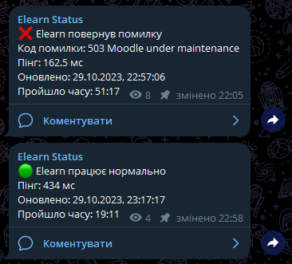

# Moodle Ping Bot
Перевіряє доступність сайту Moodle та відправляє повідомлення в Telegram, при зміні статусу.  
Бота було створено у листопаді 2022 року, під час відключень світла, щоб відслідковувати доступність сайту НУБіП.  

  
*[Elearn Status](https://t.me/elearn_nubip_status) - канал зі статусом сайту НУБіП*

## Встановлення
1. Створити бота в Telegram за допомогою [@BotFather](https://t.me/BotFather)
2. Створити публічний канал та додати бота до нього. Надати боту права адміністратора.
3. Перейменувати `config.example.json` у `config.json` та заповнити його
4. Встановити залежності `npm install`
5. Запустити бота `npm start`

## Особливості
- Не потребує бази даних, так як використовує закріплені повідомлення для збереження стану.
- Відображає повну статистику доступності сайту (час відповіді, код статусу, час з останньої зміни статусу).
- Не орієнтується на код 200, а перевіряє контент сторінки на наявність ключових слів. Може відрізнити технічні роботи від справної сторінки.
- Відновлення стану бота після перезапуску, тому можна використовувати абсолютно будь-який хостинг, навіть якщо він робить регулярні рестарти.
- Нове повідомлення в каналі буде створюватись лише при зміні статусу доступності сайту. В інших випадках буде оновлюватись існуюче повідомлення.
- Повна підтримка локалізації. Зміна тексту повідомлень відбувається в `config.json`.
- Для меншої кількості неправдивих сповіщень, при виявленні помилки, бот повторить спробу ще через 10 секунд (`'RecheckTime'` в `config.json`). Якщо помилка повториться, то сповіщення буде відправлено.
- Повідомляє про такі статуси: Працює нормально, Працює повільно, Не працює, Технічні роботи, Помилка.

## Ліцензія
Код розповсюджується під [MIT License](LICENSE) і вільний для використання, зміни та розповсюдження.  
Велике прохання поважати автора і залишити посилання на цей репозиторій, якщо ви використовуєте цей код.

## Підтримка
Якщо ви знайшли помилку, або у вас є ідеї щодо покращення бота, будь ласка, створіть [нову проблему](https://github.com/prevter/moodle-ping-bot/issues/new)